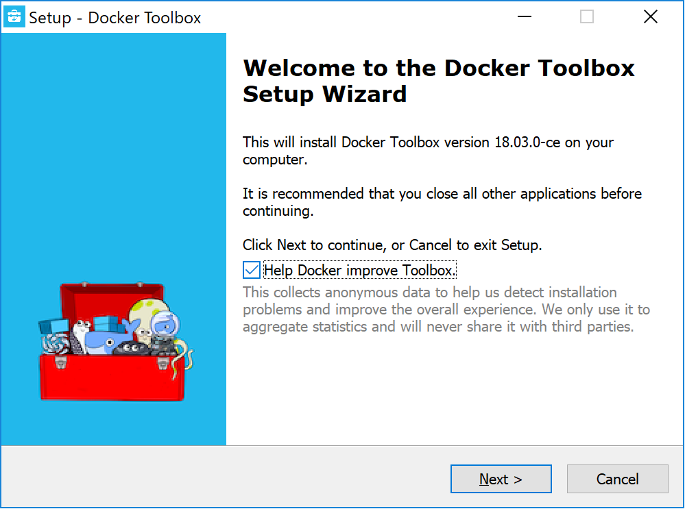
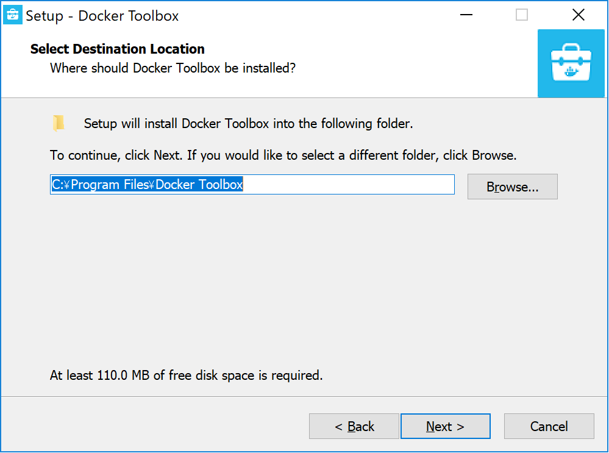
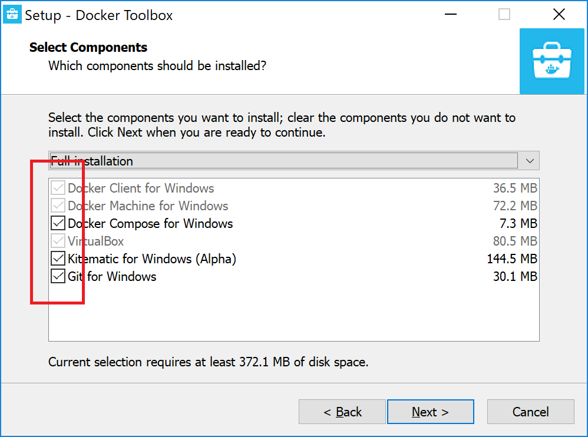
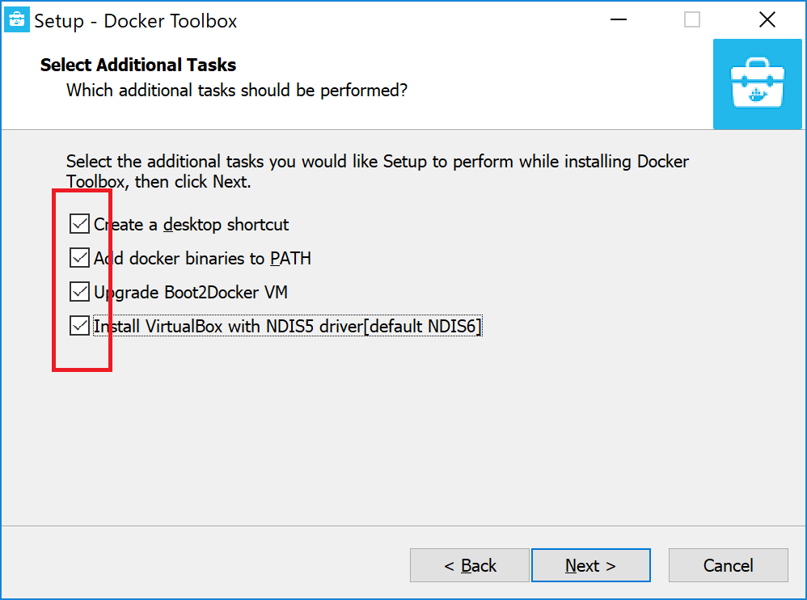
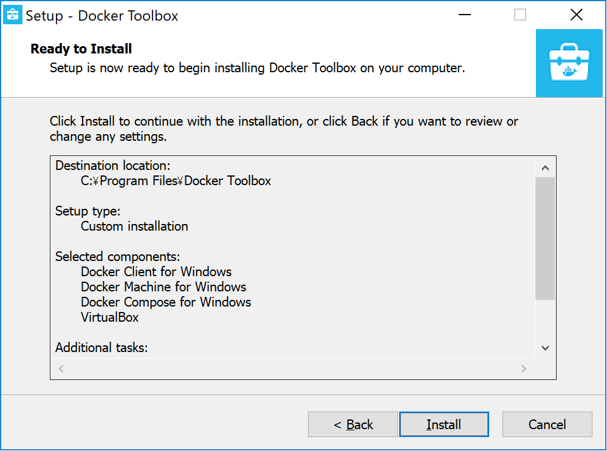
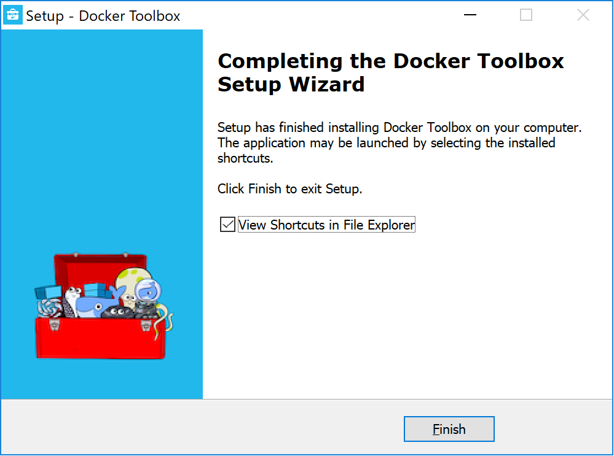
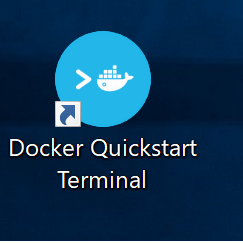
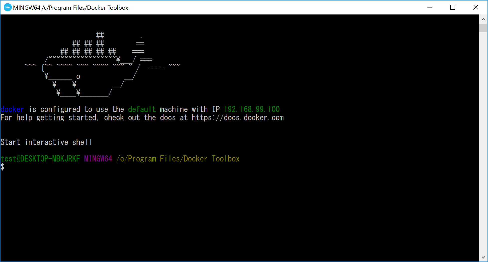

# Docker Toolbox インストール手順
1. [Docker toolbox](https://docs.docker.com/toolbox/overview/#whats-in-the-box) をダウンロード・実行
2. ダウンロードファイルの実行とインストール開始:Nextをクリック

3. インストール先の確認:Nextをクリック

4. インストールコンポーネントの選択:全てチェックがついていることを確認してNextをクリック

5. 追加設定:全てチェックしていることを確認してNextをクリック

6. インストール開始:Installをクリック

7. インストール完了:Finishをクリック

8. Docker Quick Start Terminalの起動:デスクトップのアイコンをクリック:そこそこ時間かかる  

9. インストール成功


## 補足事項
* デスクトップまでのパス(Docker Quick Start Terminal上の表記)
```
/c/Users/ユーザ名/Desktop
```
* IEではローカルにアクセスできないのでChromeなど他のブラウザを使う
* インストールの段階(手順1～5)の段階でチェックが外れているとDockerが動かない
  * その場合は一度ソフトウェアをアンインストールして再インストールする
  * アンインストールの手順
    1. コントロールパネルを開く
    2. プログラム -> プログラムのアンインストール
    3. 以下のプログラムをアンインストール(あるやつ)
      + Docker Toolbox version ～
      + Git version ～
      + Oracle VM VirtualBox ～
