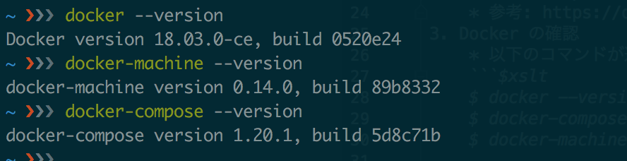
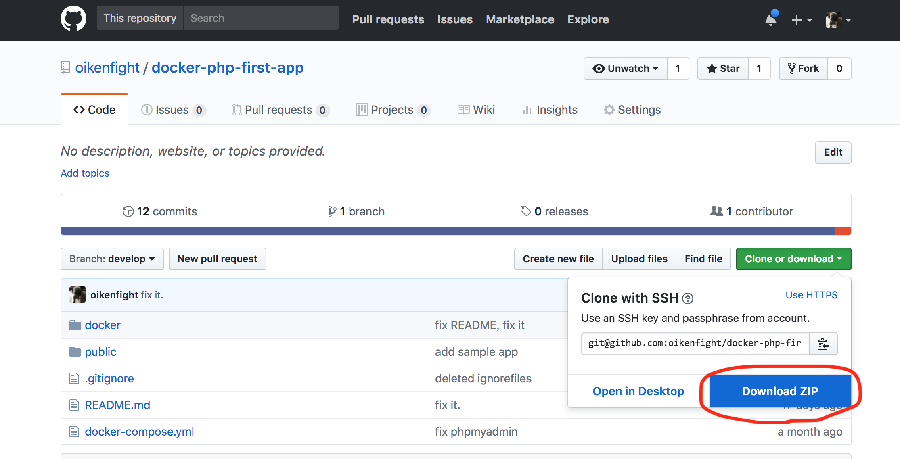
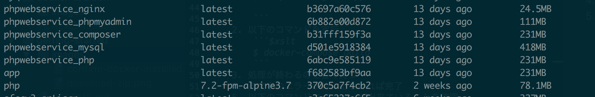
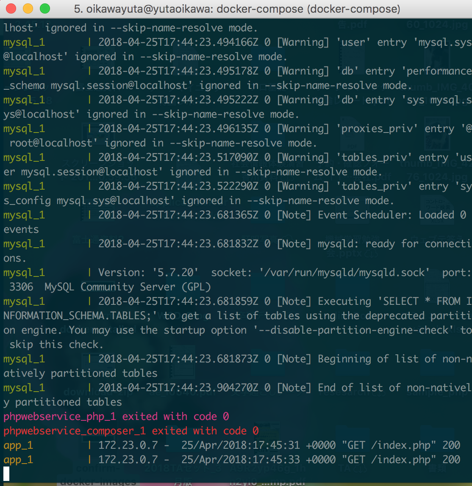
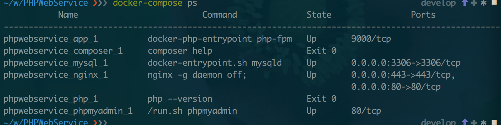
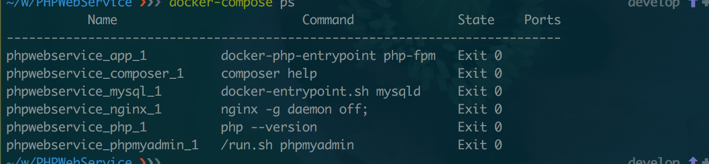
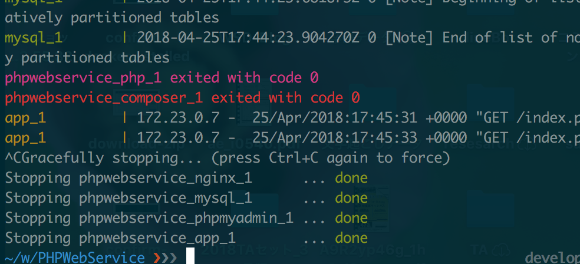
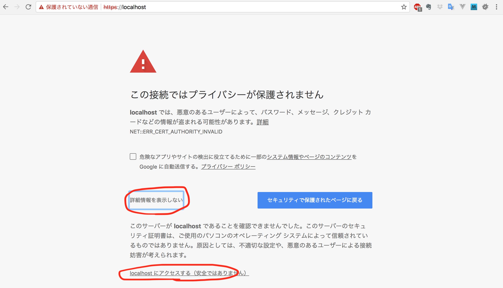
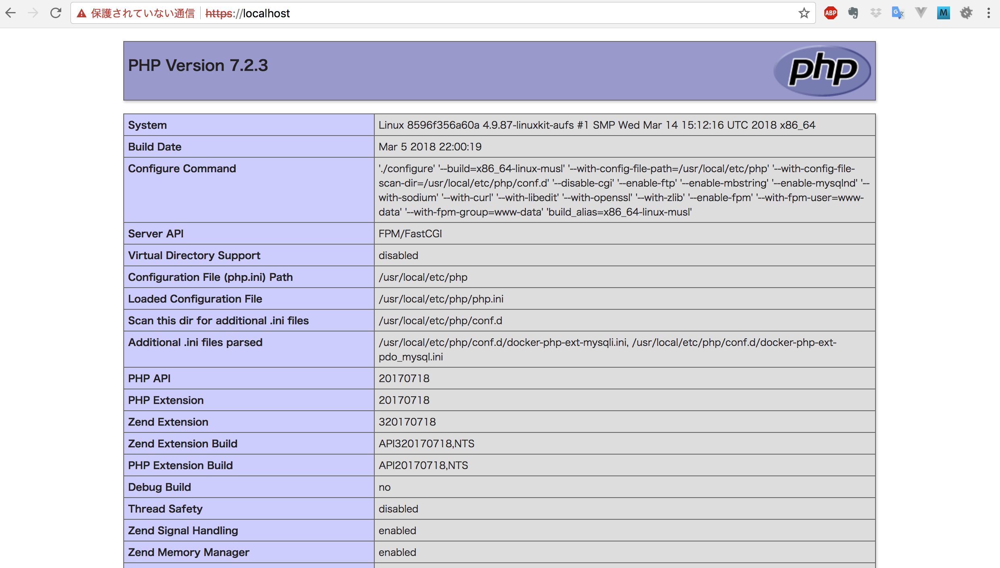

# Getting Started

## Docker の準備

#### Mac
1. [Docker for Mac](https://docs.docker.com/docker-for-mac/install/) をダウンロードする
2. Docker for Mac を起動

※ stable をダウンロードすること  
※ 参考: https://qiita.com/scrummasudar/items/750aa52f4e0e747eed68
    
#### Windows
1. [Docker toolbox](https://docs.docker.com/toolbox/overview/) をダウンロードする
2. Docker をインストールする

※ 手順: [Docker toolbox 導入手順（Windows 向け）](../docker-toolbox/README.md)

#### 確認
* 以下のコマンドが通れば OK。 （Mac は Teminal、 Windows は Docker Quick Start Terminal を使用）
    ```bash
    $ docker --version
    $ docker-compose --verison
    $ docker-machine --version
    ```
    ※ 出力例
    

    
## 必要なファイルを準備

1. 以下のリンクから環境構築に使うファイルをダウンロードする
    * https://github.com/oikenfight/docker-php-first-app
    * 右の方にある緑色の Clone or download ボタンから ZIP を選択
    
2. zip ファイルを展開
3. 展開したファイルを適当な作業スペースに移動


## 環境構築

1. CLI でダウンロードしたファイルがある場所に移動
    ```bash
    $ cd path/to/your/app
    ```
2. 以下のコマンドを実行
    ```bash
    $ docker-compose build
    ```
3. 処理が終わるのを暫く待つ
4. 赤文字のエラーが特に出なければ完了
5. 以下のコマンドで image が出来ていることを確認
    ```bash
    $ docker images
    ```
    
※ 上の画像は `docker images` コマンドの出力例（全く同じではないはず）  
※ `docker-compose build` コマンドは最初の一回だけ実行（次回起動するときは必要ない）

    
## 起動・停止

#### 起動
1. 起動（何やら処理が開始されるはず）
    ```bash
    $ docker-compose up
    ```
    
2. 新しい CLI のウィンドウを開いて、作業ディレクトリに移動
3. 起動状態確認
    ```bash
    $ docker-compose ps
    ```
    

    ※ 起動していない場合は以下のような結果になる
    

#### 停止
1. `docker-compose up` コマンドを実行したウィンドウで `Ctrl + c`



## 動作確認

#### Mac

* `https://localhost` にアクセス
* php の画面が表示されれば完了

#### Windows
* 以下のコマンドで Docker の IP を調べる （VM 名は特に何もしてなければ default）
    ```bash
    $ docker-machine ip default
    ```
* `https://（上記の ip アドレス）` にアクセス（VM が `default` なら `192.168.99.100` のはず）

※ VM を自分で作った場合 `default` の部分は適宜変更すること

#### 確認
* 上記の URL にアクセスし、「アクセスする（安全ではありません）」をクリック

* php の画面が表示されれば完了


※ 「この接続ではプライバシーが保護されません」と警告がでるけど無視（ssl認証を自己認証にしているため発生してる）。
ローカルで開発しているうちは問題ない。公開する場合は認証局からSSLサーバ証明書をちゃんと取得すること。
