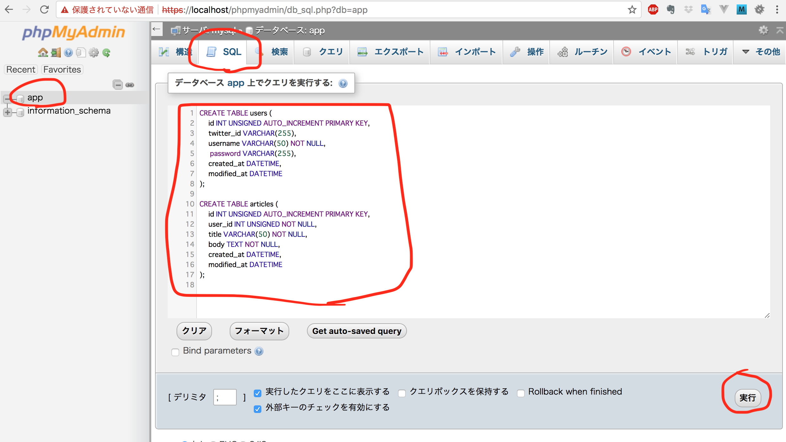

## Sample Application

### 要件
- ユーザー名とパスワードを用いたユーザー登録と認証
- Twitterアカウントを用いた登録と認証
- 新規記事投稿
- 投稿記事表示

### 構成
- 登録: `user-register.php  `
- ログイン: `login.php`   
- Twitterで登録&ログイン `twitter-login.php`
- 一覧: `index.php`
- 詳細: `article.php`
- 新規投稿: `new-article.php`
- DB情報は`config.php`にて定義
- 複数箇所で呼ばれる処理は関数に纏め、`functions.php`に定義

### 動かし方

1. データベースを作成する
    1. `public/blog-sample/db_scheme.sql` を開いて内容を全てコピーしておく
    2. `https://(localhost or 各自IP)/phpmyadmin/` にアクセスして phpmyadmin を開く
    3. 左にあるメニューから「app」を選択
    4. 画面上の方のタブメニューから「SQL」を選択
    5. テキストエリアにコピーしておいた内容を貼り付ける
    6. 実行ボタンをクリック
    7. 画面上の方のタブメニューから「構造」を選択し、articles, users テーブルがあることを確認
    

2. アプリケーションを試す
    1. `https://(localhost or 各自IP)/blog-sample/` にアクセス
    2. 新規登録してスタート
    
    
※ Twitter ログインは今のところ対応してない
